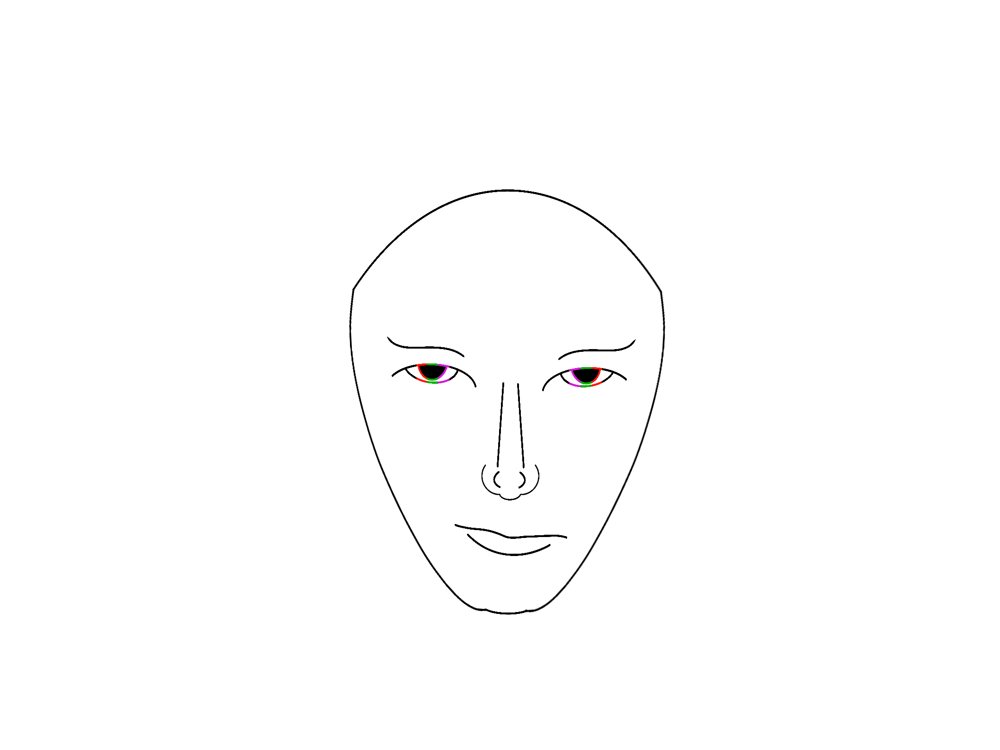

<div align="center">



# ⚡ HEX Luthor

**Seamless, borderless backgrounds for GitHub READMEs & GitHub Pages**

[](https://www.npmjs.com/package/hex-luthor)
[](LICENSE)
[](https://www.npmjs.com/package/hex-luthor)
[](https://bundlephobia.com/package/hex-luthor)

</div>

---

## What is HEX Luthor?

HEX Luthor is a **zero-dependency** tool that generates seamless, borderless SVG backgrounds for GitHub repositories. Unlike regular images that show borders or padding artifacts, HEX Luthor creates edge-to-edge backgrounds that blend perfectly into GitHub's dark/light themes.

### ✨ Features

- **🚫 Zero Borders** — True edge-to-edge backgrounds with no visible seams
- **🎨 9 Built-in Patterns** — Dots, grid, diagonal, hexagon, noise, waves, mesh, gradient, aurora
- **🌗 Dark/Light Aware** — Auto-adapts to GitHub's color schemes
- **📱 README & Pages** — Works in both GitHub READMEs and GitHub Pages sites
- **⚡ Zero Dependencies** — Pure SVG/CSS, no external assets needed
- **🖼️ Data URI Output** — Everything embedded, no broken image links
- **🔌 Simple Embed** — One-line script tag for non-technical users
- **🛠️ CLI & API** — Command line tool and programmatic API

---

## Installation

```bash
# Global install
npm install -g hex-luthor

# Local install
npm install --save-dev hex-luthor

# Or use npx (no install)
npx hex-luthor <command>
```

### CDN (Simple Embed)

```html
<script src="https://cdn.jsdelivr.net/npm/hex-luthor@latest/dist/embed.min.js" 
  data-pattern="gradient" 
  data-colors="#0d1117,#161b22"
  data-target="body"
  data-text="My Project"
  data-animation="true">
</script>
```

---

## Quick Start

### 1. CLI Commands

```bash
# Generate a README background
hex-luthor readme -p gradient -c "#0d1117,#161b22" -o bg.md

# Create a project banner
hex-luthor banner -t "My Project" -s "A cool description" -p aurora -o banner.md

# Generate Pages CSS with animation
hex-luthor pages -p dots -c "#ff6b6b,#4ecdc4" -a -o style.css

# Preview all patterns
hex-luthor preview -c "#0d1117,#21262d" -o preview.html

# Create config file
hex-luthor init
```

### 2. Programmatic API

```javascript
const HexLuthor = require('hex-luthor');

// Generate a README background
const readmeBg = HexLuthor.readme({
  pattern: 'gradient',
  colors: ['#0d1117', '#161b22'],
  height: 200
});

// Generate a banner
const banner = HexLuthor.banner({
  text: 'My Project',
  subtext: 'A cool description',
  pattern: 'aurora',
  colors: ['#0d1117', '#21262d']
});

// Generate Pages CSS
const css = HexLuthor.pages({
  pattern: 'dots',
  colors: ['#0d1117', '#21262d'],
  animation: true
});

// Get all pattern previews
const previews = HexLuthor.preview(['#0d1117', '#21262d']);
```

### 3. Simple Embed (Browser)

Drop this single script tag into any HTML page:

```html
<script src="https://cdn.jsdelivr.net/npm/hex-luthor@latest/dist/embed.min.js" 
  data-pattern="aurora" 
  data-colors="#0d1117,#21262d"
  data-target="body"
  data-text="Welcome"
  data-subtext="Seamless backgrounds"
  data-animation="true">
</script>
```

**Available attributes:**

| Attribute | Description | Default |
|-----------|-------------|---------|
| `data-pattern` | Pattern type | `gradient` |
| `data-colors` | Comma-separated hex colors | `#0d1117,#21262d` |
| `data-target` | CSS selector for target element | `body` |
| `data-text` | Banner text overlay | *(none)* |
| `data-subtext` | Subtitle text | *(none)* |
| `data-animation` | Enable animation (`true`/`false`) | `false` |
| `data-opacity` | Pattern opacity (0-1) | `0.8` |
| `data-size` | Pattern tile size (px) | `64` |

---

## Available Patterns

| Pattern | Description | Best For |
|---------|-------------|----------|
| `dots` | Subtle dot matrix | Clean, minimal repos |
| `grid` | Fine grid lines | Technical docs |
| `diagonal` | Diagonal stripes | Dynamic projects |
| `hexagon` | Honeycomb pattern | Dev tools, APIs |
| `noise` | Fractal noise texture | Creative portfolios |
| `waves` | Flowing wave lines | Data viz, analytics |
| `mesh` | Connected node mesh | Network, graph projects |
| `gradient` | Smooth color blend | General purpose |
| `aurora` | Northern lights effect | Showcases, demos |

---

## Configuration File

Create `hex-luthor.config.js` in your project root:

```bash
hex-luthor init
```

Example config:

```javascript
module.exports = {
  readme: {
    pattern: 'gradient',
    colors: ['#0d1117', '#161b22'],
    height: 200
  },
  banner: {
    text: 'Your Project Name',
    subtext: 'A short description',
    pattern: 'aurora',
    colors: ['#0d1117', '#21262d']
  },
  pages: {
    pattern: 'dots',
    colors: ['#0d1117', '#21262d'],
    animation: true
  }
};
```

---

## How It Works

HEX Luthor uses **SVG data URIs** with `patternUnits="userSpaceOnUse"` to create truly seamless tiles. Unlike PNG/JPG images that show visible edges when scaled, SVG patterns mathematically tile without borders.

The tool also injects CSS that strips GitHub's default margins and borders:

```css
body {
  background: var(--hl-bg) !important;
  margin: 0 !important;
  border: none !important;
}
```

---

## Examples

### Dark Theme Banner
```bash
hex-luthor banner -t "API Gateway" -s "High-performance routing" -p mesh -c "#0d1117,#21262d"
```

### Light Theme Banner
```bash
hex-luthor banner -t "Docs" -s "Beautiful documentation" -p waves -c "#ffffff,#f6f8fa"
```

### Animated Pages Background
```bash
hex-luthor pages -p gradient -c "#667eea,#764ba2" -a -o style.css
```

### Vibrant Pattern
```bash
hex-luthor readme -p hexagon -c "#ff6b6b,#feca57" -o vibrant.md
```

---

## API Reference

### `HexLuthor.readme(config)`

Generates a borderless background snippet for GitHub READMEs.

**Parameters:**
- `config.pattern` *(string)* — Pattern type
- `config.colors` *(string[])* — Array of hex colors
- `config.height` *(string|number)* — Height in pixels
- `config.align` *(string)* — Alignment (`left`, `center`, `right`)

**Returns:** `string` — Markdown snippet

### `HexLuthor.banner(config)`

Generates a full-width banner with text overlay.

**Parameters:**
- `config.text` *(string)* — Main banner text
- `config.subtext` *(string)* — Subtitle text
- `config.pattern` *(string)* — Pattern type
- `config.colors` *(string[])* — Array of hex colors
- `config.height` *(number)* — Banner height in pixels
- `config.textColor` *(string)* — Text color

**Returns:** `string` — Markdown snippet with embedded SVG

### `HexLuthor.pages(config)`

Generates CSS for GitHub Pages sites.

**Parameters:**
- `config.pattern` *(string)* — Pattern type
- `config.colors` *(string[])* — Array of hex colors
- `config.animation` *(boolean)* — Enable background animation
- `config.customCSS` *(string)* — Additional custom CSS

**Returns:** `string` — CSS stylesheet

### `HexLuthor.preview(colors)`

Generates preview data for all patterns.

**Parameters:**
- `colors` *(string[])* — Array of hex colors

**Returns:** `Array<{type: string, dataUri: string}>`

### `HexLuthor.color`

Color utility methods:
- `parse(color)` — Parse any color format to RGBA
- `toHex(rgba)` — Convert RGBA to hex string
- `blend(c1, c2, ratio)` — Blend two colors
- `hslToRgb(h, s, l, a)` — Convert HSL to RGB

---

## Browser Support

| Feature | Chrome | Firefox | Safari | Edge |
|---------|--------|---------|--------|------|
| CLI/API | ✅ | ✅ | ✅ | ✅ |
| Simple Embed | ✅ 60+ | ✅ 55+ | ✅ 12+ | ✅ 79+ |
| SVG Patterns | ✅ | ✅ | ✅ | ✅ |
| CSS Animation | ✅ | ✅ | ✅ | ✅ |

---

## Contributing

We welcome contributions! See [CONTRIBUTING.md](CONTRIBUTING.md) for guidelines.

### Development

```bash
# Clone the repo
git clone https://github.com/hex-luthor/hex-luthor.git
cd hex-luthor

# Install dependencies
npm install

# Run tests
npm test

# Build distribution
npm run build
```

---

## License

MIT © HEX Luthor Contributors
